<div align="center">

</div>

<div align="center">

[](https://git.io/typing-svg)

</div>

<br>

<div align="center">
  
</div>

## 🚀 About Me

```javascript
const subrat = {
    role: "Full Stack Developer",
    location: "🌍 India",
    currentFocus: "Building scalable web applications",
    learning: ["Cloud Architecture", "DevOps", "AI/ML Integration"],
    askMeAbout: ["Web Development", "System Design", "Problem Solving"],
    funFact: "Coffee + Code = Magic ☕✨"
};
```

<br>

## 🛠️ Tech Stack & Expertise

<div align="center">

### Languages


### Frontend


### Backend & Database


### Cloud & Tools


</div>

<br>

<div align="center">
  
</div>

## 📊 GitHub Statistics

<div align="center">
  
  
</div>

<div align="center">
  
</div>

<br>

## 🏆 Achievements & Trophies

<div align="center">
  
</div>

<br>

## 📈 Contribution Activity

<div align="center">
  
</div>

<br>

<div align="center">
  
</div>

## 💡 Professional Quote

<div align="center">
  
</div>

<br>

## 🎯 Current Focus

```mermaid
graph LR
    A[🎯 Goals 2024] --> B[Cloud Architecture]
    A --> C[System Design]
    A --> D[Open Source]
    B --> E[AWS Certification]
    C --> F[Scalable Apps]
    D --> G[Community Impact]
    
    style A fill:#667eea,stroke:#764ba2,stroke-width:2px,color:#fff
    style B fill:#f093fb,stroke:#f5576c,stroke-width:2px,color:#fff
    style C fill:#4facfe,stroke:#00f2fe,stroke-width:2px,color:#fff
    style D fill:#43e97b,stroke:#38f9d7,stroke-width:2px,color:#fff
```

<div align="center">



</div>

<br>

## 🌐 Connect With Me

<div align="center">
  
[](https://linkedin.com/in/yourprofile)
[](https://twitter.com/yourhandle)
[](https://yourportfolio.com)
[](mailto:your.email@example.com)

</div>

<br>

## 👁️ Profile Analytics

<div align="center">
  


</div>

<br>

---

<div align="center">
  
### 🚀 *"Innovation distinguishes between a leader and a follower"* - Steve Jobs

**💫 Thanks for visiting! Feel free to connect and collaborate on exciting projects!**

⭐ **Star my repositories if you find them interesting!**

</div>

<br>

<div align="center">

</div>
