<div align="center">

</div>

<div align="center">

[](https://git.io/typing-svg)

</div>

<br>

<div align="center">
  
</div>

## 🚀 About Me

```javascript
const subrat = {
    role: "Full Stack Developer",
    location: "🌍 India",
    currentFocus: "Building scalable web applications",
    learning: ["Advanced React Patterns", "Mobile Development", "Desktop Applications"],
    askMeAbout: ["Web Development", "Mobile App Development", "Desktop App Development"],
    funFact: "Coffee + Code = Magic ☕✨"
};
```

<br>

## 🛠️ Tech Stack & Expertise

<div align="center">

### 💻 Languages
<p align="center">
  
  
  
  
</p>

### 🎨 Frontend Development
<p align="center">
  
  
  
  
  
</p>

### ⚙️ Backend Development
<p align="center">
  
  
  
</p>

### 📱 Mobile Development
<p align="center">
  
</p>

### 🖥️ Desktop Development
<p align="center">
  
</p>

### 🗄️ Database
<p align="center">
  
  
</p>

### 🛠️ Tools & Version Control
<p align="center">
  
  
  
</p>

</div>

<br>

<div align="center">
  
</div>

## 📊 GitHub Statistics

<div align="center">
  
  
</div>

<br>

## 🎯 Current Focus

```mermaid
graph LR
    A[🎯 Goals 2025] --> B[React Native]
    A --> C[Desktop Applications]
    A --> D[Advanced Web Development]
    A --> E[Open Source]
    B --> F[Cross-Platform Mobile Apps]
    C --> G[WPF Applications]
    D --> H[Full Stack Mastery]
    E --> I[Community Impact]
    
    style A fill:#667eea,stroke:#764ba2,stroke-width:2px,color:#fff
    style B fill:#f093fb,stroke:#f5576c,stroke-width:2px,color:#fff
    style C fill:#4facfe,stroke:#00f2fe,stroke-width:2px,color:#fff
    style D fill:#43e97b,stroke:#38f9d7,stroke-width:2px,color:#fff
    style E fill:#ffeaa7,stroke:#fdcb6e,stroke-width:2px,color:#2d3436
```

<div align="center">



</div>

<br>

## 🚀 Development Areas

<div align="center">

### 🌐 Web Development
**Frontend:** React, HTML5, CSS3, SCSS, TailwindCSS, JavaScript, TypeScript  
**Backend:** Laravel (PHP), .NET Core, .NET Framework

### 📱 Mobile Development
**Cross-Platform:** React Native for iOS & Android

### 🖥️ Desktop Development
**Windows Applications:** WPF with .NET Framework/.NET Core

### 🗄️ Database Management
**Relational Databases:** MySQL, SQL Server

</div>

<br>

## 🏆 Achievements & Trophies

<div align="center">
  
</div>

<br>

## 📈 Contribution Activity

<div align="center">
  
</div>

<br>

<div align="center">
  
</div>

## 💡 Professional Quote

<div align="center">
  
</div>

<br>

## 🌐 Connect With Me

<div align="center">
  
[](https://www.linkedin.com/in/mrsubrat/)
[](mailto:skumarsahoo470@gmail.com)

</div>

<br>

## 👁️ Profile Analytics

<div align="center">
  


</div>

<br>

---

<div align="center">
  
### 🚀 *"Innovation distinguishes between a leader and a follower"* - Steve Jobs

**💫 Thanks for visiting! Feel free to connect and collaborate on exciting projects!**

⭐ **Star my repositories if you find them interesting!**

</div>

<br>

<div align="center">

</div>
